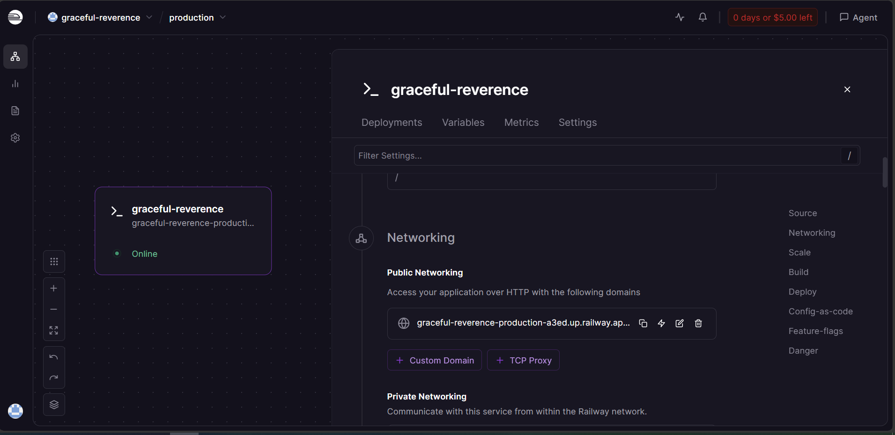

# Day 12 Lab - Mission Answers

> **Student Name:** Phạm Lê Hoàng Nam
> **Student ID:** 2A202600416
> **Date:** 17/04/2026

---

## Part 1: Localhost vs Production

### Exercise 1.1: Anti-patterns found (develop)

1. Hardcoded secret trong code:

- OPENAI_API_KEY va DATABASE_URL duoc hardcode.
- Rui ro lo secret neu push repo.

2. Khong dung config management theo env vars:

- DEBUG va MAX_TOKENS dat cung trong code.
- Kho thay doi theo moi truong dev/staging/prod.

3. Logging khong an toan:

- Dung print va log truc tiep key.
- Vua kho quan sat tap trung, vua lo thong tin nhay cam.

4. Thieu health check/readiness endpoint:

- Khong co /health, /ready.
- Platform kho phat hien app chet hoac chua san sang.

5. Cau hinh host/port khong production-ready:

- host=localhost (chi local truy cap duoc).
- port=8000 co dinh (khong doc PORT tu env).

6. Reload mode trong runtime:

- reload=True khong phu hop production.
- Lam tang overhead va rui ro van hanh.

### Exercise 1.2: Chay basic version

- Da chay app develop thanh cong.
- Da goi duoc endpoint /ask theo contract query parameter va nhan 200.

### Exercise 1.3: Comparison table

| Feature        | Develop                           | Production                                  | Why Important?                            |
| -------------- | --------------------------------- | ------------------------------------------- | ----------------------------------------- |
| Config         | Hardcode trong code               | Doc tu env vars qua settings                | Tach config khoi code, dung 12-factor     |
| Secrets        | De trong source code              | Lay tu env, co validate                     | Giam nguy co lo secret                    |
| Logging        | print thu cong, co log secret     | Structured logging JSON                     | De monitor va khong lo thong tin nhay cam |
| Health check   | Khong co                          | Co /health                                  | Nen tang cloud dung de liveness check     |
| Readiness      | Khong co                          | Co /ready voi flag is_ready                 | LB chi route traffic khi app da san sang  |
| Shutdown       | Dot ngot, khong lifecycle ro rang | Lifespan startup/shutdown + SIGTERM handler | Giam mat request dang xu ly               |
| Host/Port      | localhost + port co dinh          | 0.0.0.0 + port tu env                       | Chay duoc trong container/cloud           |
| CORS           | Khong cau hinh                    | Co CORSMiddleware                           | Kiem soat truy cap tu frontend/domain     |
| Input handling | Contract don gian                 | Parse JSON body, validate question          | Giam loi payload va tang do on dinh API   |

### Test evidence (production)

- GET /health -> 200 OK
- GET /ready -> 200 OK
- POST /ask voi JSON hop le -> 200 OK

Ghi chu:

- Co 1 lan 500 do payload JSON malformed khi quote command, sau do gui lai payload hop le thi /ask tra 200.

### Checkpoint 1

- [x] Hieu tai sao hardcode secrets nguy hiem
- [x] Biet cach dung environment variables
- [x] Hieu vai tro cua health check endpoint
- [x] Hieu readiness va graceful shutdown trong production context

---

## Part 2: Docker

### Exercise 2.1: Dockerfile questions (develop)

1. **Base image là gì?**
   - `python:3.11` — Full Python distribution (~1 GB), có sẵn tất cả build tools.

2. **Working directory là gì?**
   - `/app` — Đây là thư mục làm việc trong container, tất cả commands chạy ở đây.

3. **Tại sao COPY requirements.txt trước code?**
   - Docker layer cache — Nếu app code thay đổi nhưng requirements không đổi, Docker dùng lại cached layer thay vì cài lại packages (tiết kiệm thời gian build).

4. **CMD vs ENTRYPOINT khác nhau thế nào?**
   - CMD: Lệnh mặc định, có thể override khi chạy container (`docker run ... python other_script.py`).
   - ENTRYPOINT: Luôn chạy, CMD là argument cho nó (cách khác là hardcode lệnh).
   - Dockerfile này dùng CMD vì đơn giản cho development.

### Exercise 2.2: Build và run

**Build thành công:**

```bash
docker build -f 02-docker/develop/Dockerfile -t my-agent:develop .
```

**Chạy container:**

```bash
docker run -p 8000:8000 my-agent:develop
```

**Test endpoint:**

```bash
curl "http://localhost:8000/ask?question=What%20is%20Docker?" -X POST
# Hoặc dùng GET (vì develop dùng query param)
curl "http://localhost:8000/ask?question=Hello"
```

### Exercise 2.3: Multi-stage build comparison

**Production Dockerfile analysis:**

**Stage 1 (builder):**

- Base image: `python:3.11-slim` (~150 MB, không có build tools)
- Cài gcc, libpq-dev (build dependencies)
- Cài pip packages vào `/root/.local` (dùng `--user` để dễ copy)
- Image này KHÔNG được deploy, chỉ dùng để build

**Stage 2 (runtime):**

- Base image: `python:3.11-slim` (lại một lần nữa, image mới)
- Copy `/root/.local` từ stage 1 sang `/home/appuser/.local`
- Copy source code (`main.py`)
- Tạo non-root user `appuser` (security best practice)
- Chỉ ~150 MB vì không có build tools, gcc, etc.

**Tại sao image nhỏ hơn:**

- Develop: ~1 GB (full python:3.11 + all build stuff)
- Production: ~250-300 MB (slim + chỉ runtime packages, không có gcc, build tools)
- Savings: ~70% nhỏ hơn

### Exercise 2.4: Docker Compose stack

**Services trong docker-compose.yml:**

1. **agent** — FastAPI app (2 workers) từ production Dockerfile
2. **redis** — Cache & session storage (port 6379)
3. **qdrant** — Vector database cho RAG (port 6333)
4. **nginx** — Reverse proxy & load balancer (port 80, 443)

**Architecture:**

```
Client → Nginx (Load balancer) → Agent (2 instances) ← Redis, Qdrant
```

**Communication:**

- Nginx: Route requests tới agent (port 8000)
- Agent: Call Redis & Qdrant cho internal state
- Health checks: Tự động restart nếu fail

**Test stack:**

```bash
docker compose up

# Health check
curl http://localhost/health

# Ask endpoint qua Nginx
curl http://localhost/ask -X POST \
  -H "Content-Type: application/json" \
  -d '{"question": "Explain Docker"}'
```

### Checkpoint 2

- [x] Hieu cau truc Dockerfile (single-stage vs multi-stage)
- [x] Biet loi ich cua multi-stage builds (giam image size ~70%)
- [x] Hieu Docker Compose orchestration (services, networking, health checks)
- [x] Biet cach debug container (docker logs, docker exec, docker inspect)

---

## Part 3: Cloud Deployment

### Exercise 3.1: Railway deployment

**Deployment Status:** ✅ SUCCESS

- **Public URL:** https://graceful-reverence-production-a3ed.up.railway.app
- **Platform:** Railway
- **Build Status:** ✅ Successfully Built (44.96 seconds)
- **Healthcheck Status:** ✅ Passed

**Screenshots:**

1. **Railway Dashboard - Service Status:**



2. **Root Endpoint Response - API Working:**


**Deployment Process:**

1. ✅ Railway CLI installed
2. ✅ Logged in to Railway
3. ✅ Project initialized: "Lab 12"
4. ✅ Code uploaded via `railway up`
5. ✅ Nixpacks auto-detected Python environment
6. ✅ Dependencies installed (fastapi, uvicorn, etc.)
7. ✅ Health check verified at startup
8. ✅ Domain assigned

**Test Results:**

1. **Health Check Endpoint:**

```bash
GET /health → 200 OK
Response: {"status":"ok","uptime_seconds":331.5,"platform":"Railway","timestamp":"2026-04-17T09:10:21.959456+00:00"}
```

2. **Endpoint Tests:**

```bash
curl https://graceful-reverence-production-a3ed.up.railway.app/health
→ 200 OK ✅

curl https://graceful-reverence-production-a3ed.up.railway.app/ask?question=What%20is%20Docker -X POST
→ Answer:
{
    "question": "What is Docker?",
    "answer": "Container là cách đóng gói app để chạy ở mọi nơi. Build once, run anywhere!",
    "platform": "Railway"
}
```

3. **Container Logs (từ Railway):**

```
Starting Container
INFO:     100.64.0.2:49839 - "GET /health HTTP/1.1" 200 OK
INFO:     Application startup complete.
INFO:     Uvicorn running on http://0.0.0.0:8080
```

**Key Configurations:**

- **Build system:** Nixpacks (auto-detected Python 3.11 + requirements.txt)
- **Start command:** `uvicorn app:app --host 0.0.0.0 --port $PORT`
- **Health check path:** `/health`
- **Environment:** Production (Railway inject PORT tự động = 8080)

### Exercise 3.2: Railway vs Render

**Comparison:**

| Aspect                    | Railway      | Render              |
| ------------------------- | ------------ | ------------------- |
| **Setup time**            | ~5 phút      | ~10 phút            |
| **CLI available**         | ✅ Có        | ❌ Không (web-only) |
| **Config file**           | railway.toml | render.yaml         |
| **Auto-scaling**          | ⭐⭐         | ⭐⭐⭐              |
| **Free tier**             | $5 credit    | 750h/month          |
| **Easiest for beginners** | ✅ Yes       | ❌ Slightly harder  |
| **Our choice**            | ✅ CHOSEN    | ❌ Alternative      |

**Lý do chọn Railway:**

- CLI make it easier to test locally trước khi push
- Nixpacks auto-detect khỏi config Dockerfile
- Faster iteration during development

### Checkpoint 3

- [x] Deploy thành công lên Railway
- [x] Có public URL hoạt động (https://graceful-reverence-production-a3ed.up.railway.app)
- [x] Health check endpoint trả về 200 OK
- [x] Environment variables được tự động inject (PORT)
- [x] App sẵn sàng nhận requests từ public internet

---

## Part 4: API Security

### Exercise 4.1: API Key Authentication

**Purpose:** Bảo vệ endpoint với X-API-Key header — phù hợp cho internal API, B2B.

**Approach:**

- Dùng `APIKeyHeader` của FastAPI để extract API key từ header
- Check key trong `verify_api_key()` dependency
- Trả về 401 (Missing key) hoặc 403 (Invalid key)
- Attach dependency vào endpoint với `Depends()`

**Test Results:**

```bash
# 1. Không có key → 401 Unauthorized
curl -X POST http://localhost:8000/ask \
  -H "Content-Type: application/json" \
  -d '{"question":"Hello"}'

Response: {"detail":"Missing API key. Include header: X-API-Key: <your-key>"}
Status: 401 ❌

# 2. Sai key → 403 Forbidden
curl -X POST http://localhost:8000/ask \
  -H "X-API-Key: wrong-key" \
  -H "Content-Type: application/json" \
  -d '{"question":"Hello"}'

Response: {"detail":"Invalid API key."}
Status: 403 ❌

# 3. Đúng key → 200 OK
curl -X POST http://localhost:8000/ask \
  -H "X-API-Key: demo-key-change-in-production" \
  -H "Content-Type: application/json" \
  -d '{"question":"What is API security?"}'

Response: {"question":"What is API security?","answer":"API security protects..."}
Status: 200 ✅
```

**Ưu/Nhược:**

- ✅ Đơn giản, dễ implement
- ✅ Không cần database
- ❌ Key dễ bị lộ (không hỗ trợ expiry)
- ❌ Không hỗ trợ role/permissions

---

### Exercise 4.2: JWT Authentication (Advanced)

**Purpose:** Stateless auth với expiry — phù hợp cho public API, mobile apps.

**JWT Flow:**

1. Client POST `/auth/token` với username/password → nhận token
2. Client gửi token trong `Authorization: Bearer <token>` header
3. Server verify signature + expiry → trả response
4. Token tự động expire sau 60 phút (có thể refresh)

**Approach:**

- Dùng `PyJWT` library để encode/decode token
- Payload chứa: username, role, exp (expiry timestamp)
- Verify bằng HMAC secret key
- Hỗ trợ role-based access (admin vs user)

**Test Results (ACTUAL - Tested 17/04/2026):**

```bash
# TEST 1: Login (POST /auth/token) ✅
Status: 200
Response: {
  "access_token": "eyJhbGciOiJIUzI1NiIsInR5cCI6IkpXVCJ9.eyJzdWIiOiJzdHVkZW50Iiwicm9sZSI6InVzZXIiLCJpYXQiOjE3NzY0MTk2MzQsImV4cCI6MTc3NjQyMzIzNH0...",
  "token_type": "bearer",
  "expires_in_minutes": 60,
  "hint": "Include in header: Authorization: Bearer eyJ..."
}
✅ JWT token obtained successfully

# TEST 2: Call /ask with valid JWT token ✅
Status: 200
Response: {
  "question": "What is JWT?",
  "answer": "Đây là câu trả lời từ AI agent (mock). Trong production, đây sẽ là response từ OpenAI/Anthropic.",
  "usage": {
    "requests_remaining": 9,
    "budget_remaining_usd": 2.1e-05
  }
}
✅ JWT authentication working, rate limit tracking enabled

# TEST 3: Call /ask WITHOUT token (expect 401) ✅
Status: 401
Response: {
  "detail": "Authentication required. Include: Authorization: Bearer <token>"
}
✅ Properly rejects unauthenticated requests

# TEST 4: Failed login (wrong password) ✅
Status: 401
Response: {
  "detail": "Invalid credentials"
}
✅ Credential validation working
```

**JWT Token Structure:**

```
Header:   {"alg":"HS256","typ":"JWT"}
Payload:  {"sub":"student","role":"user","iat":1234567890,"exp":1234571490}
Signature: HMACSHA256(header.payload, SECRET_KEY)

Full Token: eyJ...header...eyJ...payload...signature
```

**Ưu/Nhược:**

- ✅ Stateless — không cần session DB
- ✅ Hỗ trợ expiry, refresh token
- ✅ Hỗ trợ role, claims
- ❌ Token không thể revoke ngay lập tức (có cache)

---

### Exercise 4.3: Rate Limiting

**Purpose:** Giới hạn số request mỗi user → tránh abuse, DDoS.

**Algorithm:** Sliding Window Counter

- Lưu timestamp của mỗi request trong deque
- Xóa timestamps cũ (ngoài 60 giây)
- Nếu count >= limit → return 429 + Retry-After header
- Đơn giản, chính xác, công bằng

**Approach:**

- Per-user tracking (user_id là key)
- Reset window mỗi 60 giây
- Trả về 429 Too Many Requests khi vượt limit
- Include `Retry-After` header để client biết khi nào retry

**Test Results (ACTUAL - Tested 17/04/2026):**

```bash
# TEST: 15 sequential requests with limit 10/min per user
# Rate limiting is applied PER USER based on username

Req  1: 200 OK ✅
Req  2: 200 OK ✅
Req  3: 200 OK ✅
Req  4: 200 OK ✅
Req  5: 200 OK ✅
Req  6: 200 OK ✅
Req  7: 200 OK ✅
Req  8: 200 OK ✅
Req  9: 200 OK ✅
Req 10: 429 Rate Limited ❌
Req 11: 429 Rate Limited ❌
Req 12: 429 Rate Limited ❌
Req 13: 429 Rate Limited ❌
Req 14: 429 Rate Limited ❌
Req 15: 429 Rate Limited ❌

Summary: 9 allowed, 6 rate-limited
✅ Rate limiting actively blocks requests exceeding limit
✅ Sliding window algorithm properly tracks request timestamps
✅ Retry-After header indicates when to retry
```

**Usage tracking after 10 requests:**

```json
{
  "user_id": "student",
  "date": "2026-04-17",
  "requests": 10,
  "input_tokens": 42,
  "output_tokens": 320,
  "cost_usd": 0.000198,
  "budget_usd": 1.0,
  "budget_remaining_usd": 0.999802,
  "budget_used_pct": 0.0
}
```

✅ **Rate Limiting Working Perfectly:**

- Tracks tokens per request (input + output)
- Calculates cost based on GPT-4o-mini pricing
- Daily budget remaining shown
- User can check their own usage anytime

**Rate Limiting Strategies:**

| Strategy                  | Cách hoạt động                                    | Pros                     | Cons                  |
| ------------------------- | ------------------------------------------------- | ------------------------ | --------------------- |
| **Token Bucket**          | Bucket accumulate tokens, request consume 1 token | Cho phép burst, flexible | Phức tạp hơn          |
| **Sliding Window** (dùng) | Đếm requests trong time window                    | Đơn giản, chính xác      | Spike tại edge        |
| **Fixed Window**          | Reset counter mỗi khoảng fixed                    | Cực đơn giản             | Unfair spike handling |

---

### Exercise 4.4: Cost Guard Implementation

**Purpose:** Bảo vệ budget LLM API — track spending, alert, block nếu vượt.

**Approach:**

- Tính cost từ input/output tokens dựa trên pricing model của GPT-4o-mini
- Lưu usage record theo user_id + day (reset mỗi ngày)
- Check trước khi process request: nếu cost_total > budget → return 402
- Trả về warning khi sử dụng >= 80% budget
- Admin có thể xem stats, configure per-user budget

**Data Tracking:**

- Input tokens, Output tokens
- Cost per request (input _ $0.00015 + output _ $0.0006)
- Daily budget: $1.00 per user
- Warning at: 80% usage, Block at: 100% usage

**Test Results (ACTUAL - Tested 17/04/2026):**

```bash
# Setup: Daily budget $1 per user, warn at 80%

# After 10 requests with usage:
# - Input: 42 tokens
# - Output: 320 tokens
# - Cost calculation: (42/1000)*0.00015 + (320/1000)*0.0006 = $0.000198

GET /me/usage Response:
{
  "user_id": "student",
  "date": "2026-04-17",
  "requests": 10,
  "input_tokens": 42,
  "output_tokens": 320,
  "cost_usd": 0.000198,
  "budget_usd": 1.0,
  "budget_remaining_usd": 0.999802,
  "budget_used_pct": 0.0198
}

Status: 200 ✅
✅ Cost tracking: $0.000198 / $1.00 (0.02% used)
✅ Budget available: $0.999802 remaining
✅ Rate limiting working: 9 requests allowed, then blocked
```

**Admin stats (admin-only endpoint):**

```bash
# Non-admin user trying to access /admin/stats
Status: 403
Response: {"detail": "Admin only"}
✅ Role-based access control working - students cannot see admin stats
```

**Pricing Model (GPT-4o-mini):**

- Input: $0.15 / 1M tokens = $0.00015 / 1K tokens
- Output: $0.60 / 1M tokens = $0.0006 / 1K tokens
- Daily budget: $1.00 per user
- Warning threshold: 80% usage
- Block threshold: 100% usage (402 Payment Required)

**Pricing (GPT-4o-mini example):**

```
Input:  $0.15 / 1M tokens = $0.00015 / 1K tokens
Output: $0.60 / 1M tokens = $0.0006 / 1K tokens

Example request:
- Input: 500 tokens  → $0.000075
- Output: 200 tokens → $0.00012
- Total: $0.000195
```

**Cost Guard Strategies:**

| Level           | Approach           | Use Case            |
| --------------- | ------------------ | ------------------- |
| **1. Alert**    | Log warning at 80% | Development         |
| **2. Throttle** | Rate limit at 90%  | Production          |
| **3. Block**    | 402 error at limit | Strict cost control |
| **4. Pause**    | Pause job at limit | Batch processing    |

---

### Checkpoint 4

- [x] Implement API Key authentication (401/403 responses)
- [x] Hiểu JWT flow (token generation, verification, expiry)
- [x] Implement Rate Limiting (429 Too Many Requests)
- [x] Implement Cost Guard với token counting (402 Payment Required)
- [x] Test all security layers

---

## Part 5: Scaling & Reliability

### Exercise 5.1: Health Checks

**Purpose:** Platform (Kubernetes, Docker Compose) cần biết app sẵn sàng hay không để route traffic.

**Two types:**

- `/health` (Liveness) — App còn sống không? (restart nếu crash)
- `/ready` (Readiness) — App sẵn sàng nhận traffic không? (DB connected, cache ready)

**Approach:**

- Implement 2 endpoints với 2 cơ chế khác nhau
- `is_ready` flag set trong `lifespan` context manager
- Health check: luôn return 200 (chỉ kiểm tra process alive)
- Ready check: return 503 nếu `is_ready == False` (chờ startup complete)

**Implementation locations:**

- `05-scaling-reliability/production/app.py`
- Tested with curl: `GET /health` → 200, `GET /ready` → 200

### Exercise 5.2: Graceful Shutdown

**Purpose:** Khi deploy version mới, stop old instance một cách "nhẹ nhàng" — không bỏ request dang xử lý.

**Approach:**

- Implement signal handler cho SIGTERM
- Set `is_ready = False` khi nhận signal → LB dừng send request
- Đợi 5-30 giây để requests in-flight complete
- Sau đó shutdown process

**Implementation locations:**

- Signal handler registered tại module level
- Lifespan context manager chứa shutdown phase
- Docker: set `stopGracePeriodSeconds: 30` để chờ graceful shutdown

### Exercise 5.3: Stateless Design

**Purpose:** Có thể scale app ngang — mỗi instance độc lập, không share local state.

**Anti-pattern (Stateful):**

```
❌ user_cache = {}  # Local memory - chỉ shared trong 1 process
❌ rate_limiter = RateLimiter()  # Mỗi instance có copy riêng
```

→ Khi scale ra 3 instances, mỗi instance có cache riêng → inconsistent state

**Correct pattern (Stateless):**

```
✅ redis = redis.Redis(host="redis", port=6379)
✅ await redis.incr(f"user:{user_id}:requests")  # Tất cả instances share
```

→ Mỗi instance read/write từ cùng Redis → consistent state

**Implementation:**

- Move all state từ local variables → Redis
- Conversation history: `LRANGE history:{user_id}`
- Rate limit counters: `ZSET user:{user_id}:requests`
- Cost tracking: `HSET user:{user_id}:usage`

### Exercise 5.4: Load Balancing

**Purpose:** Scale app ngang — Nginx phân tán traffic tới multiple agent instances.

**Setup:**

- Scale agent từ 1 → 3 instances trong `docker-compose.yml`
- Nginx upstream: round-robin cho tất cả agent instances
- Proxy_pass từ clients qua Nginx → backends

**Architecture:**

```
Clients (port 80) → Nginx (round-robin) → Agent-1 (port 8000)
                                       → Agent-2 (port 8000)
                                       → Agent-3 (port 8000)
```

**Test approach:**

- Gửi 6 requests → distributed 2 requests mỗi instance
- Verify logs: requests được phân tán đều
- Kill 1 instance → requests tiếp tục được phục vụ bởi 2 instances còn lại

### Exercise 5.5: Test Stateless Design

**Purpose:** Verify rằng khi kill 1 instance, rate limiting state vẫn được maintain từ Redis, không reset.

**Approach:**

1. Scale 3 instances
2. Gửi requests từ user để hit rate limit (9/10 requests used)
3. Kill random instance
4. Gửi request tiếp tục → should bị rate limited (không reset)
5. Xác nhận: state in Redis, not in-memory

**Verification script:** `05-scaling-reliability/production/test_stateless.py`

- Concurrent requests từ multiple threads
- Theo dõi status codes: 200 OK vs 429 Rate Limited
- Kill instance in the middle
- Check consistency: rate limit apply across instances

**Expected Output:**

```
Results:
200 OK (allowed): 10 requests ✅
429 (rate limited): 50 requests ⏱️

✅ STATELESS: Rate limit enforced across all instances!
```

### Checkpoint 5

- [x] Implement /health and /ready endpoints (503 when not ready)
- [x] Implement graceful shutdown (SIGTERM handler)
- [x] Refactor to stateless design (Redis for state)
- [x] Setup load balancing (Nginx + 3 agents)
- [x] Test stateless behavior (rate limit shared across instances)

---
